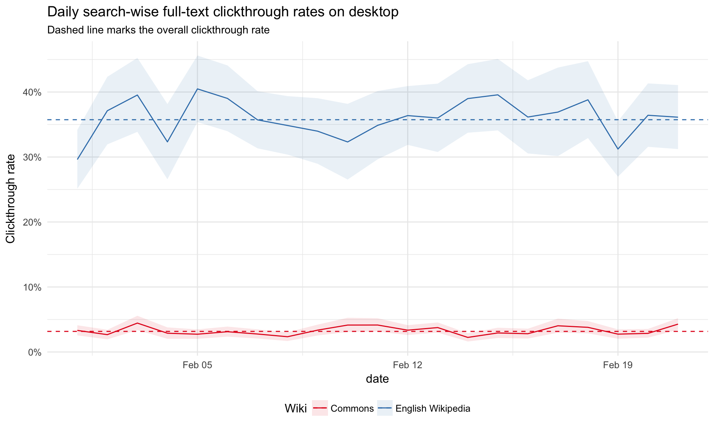
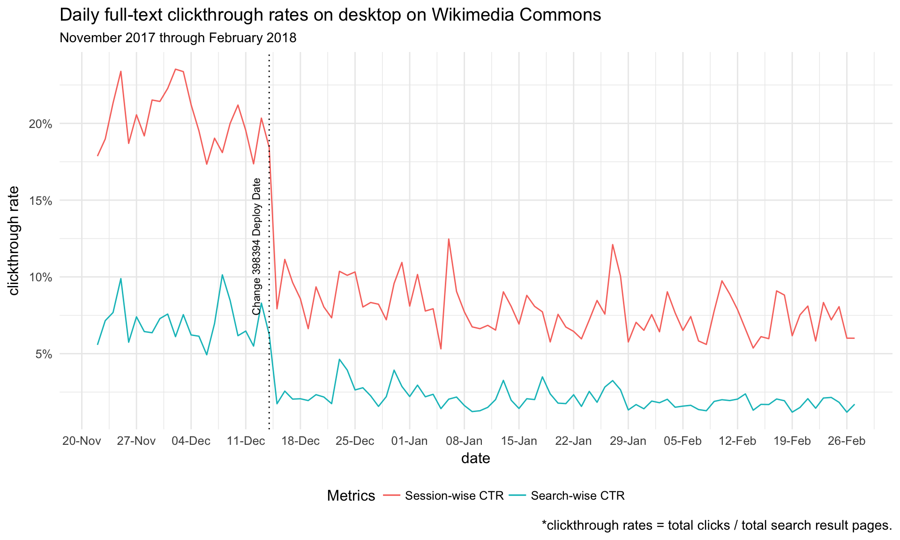
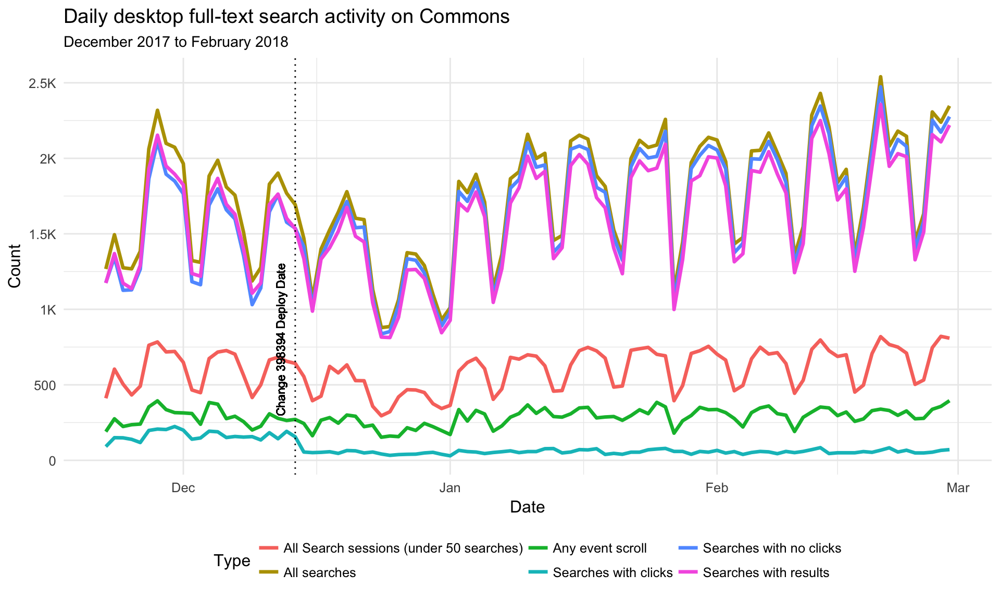
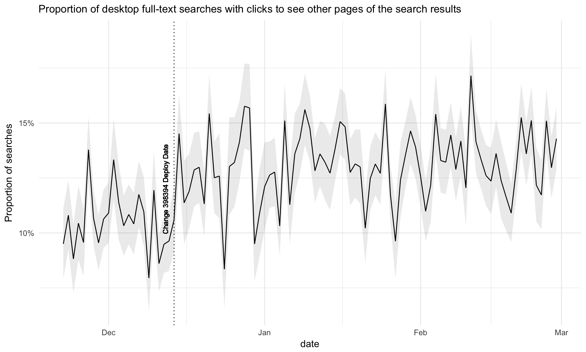
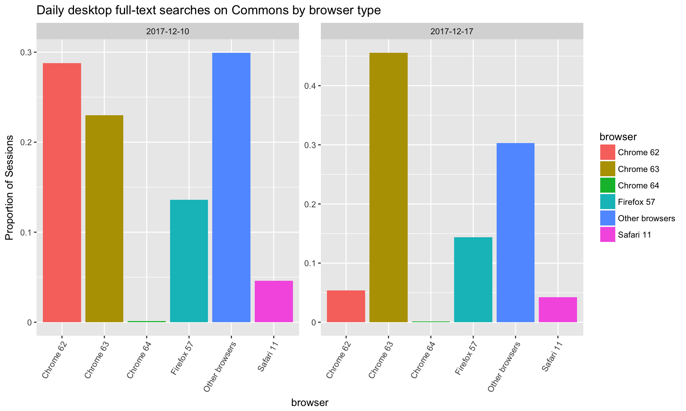
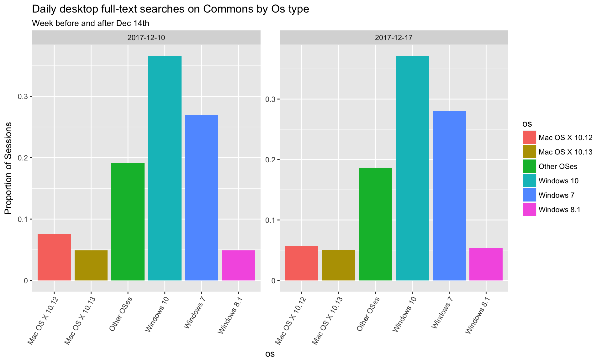
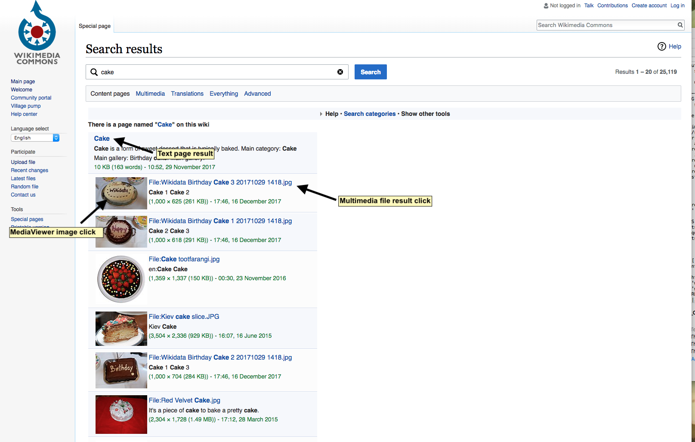
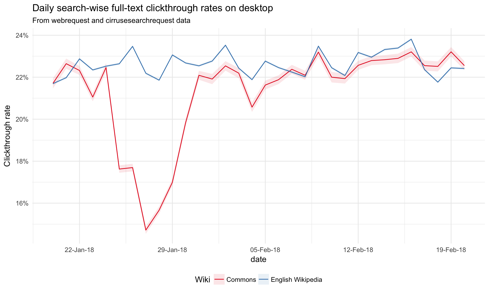
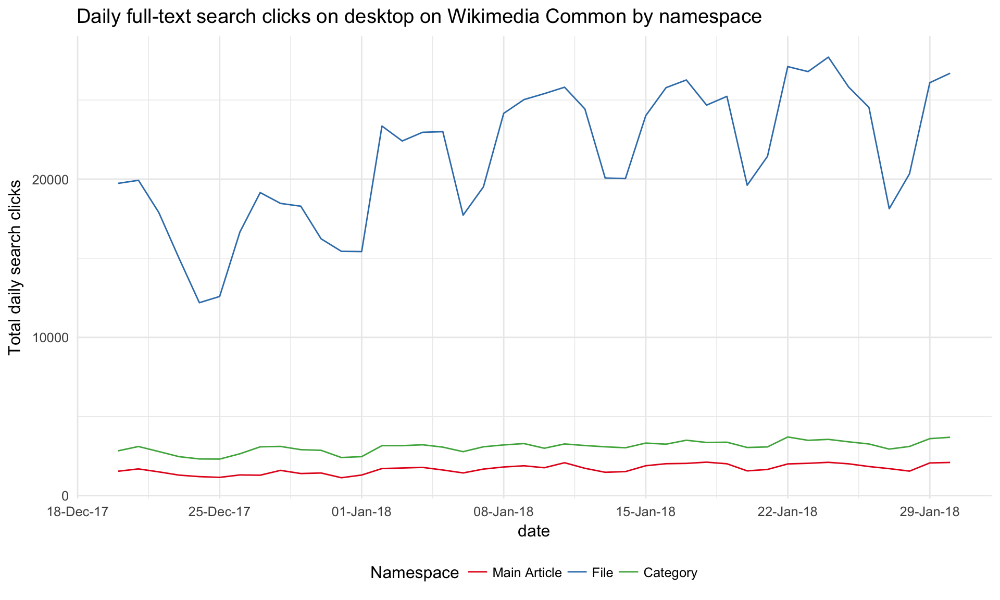

# Investigate the full-text desktop search CTR decline on Wikimedia Commons

## Overview
In [T187827](https://phabricator.wikimedia.org/T187827), we saw a decline in the overall desktop full-text search-wise clickthrough rate on Commons from 10.42% in November 2017 to 3.17% in February 2018. To find out the cause of the decline, we reviewed search metrics from November 2017 to February 18 to identify the time and potential causes of the decline.

## Direction for investigation

1. Get the search-wise and session-wise CTR from November 2017 to February 2018. Is it a gradual decline or sudden drop? Do we see the same pattern?
3. Before and after the drop, does the distribution of the users (in terms of browser and operating systems) change a lot?
4. Check the log of several sessions with no click, is there any pattern?
5. Is this happening on other wiki as well?

Ticket: [T188421](https://phabricator.wikimedia.org/T188421)

## Search-wise and session-wise CTR from November 2017 to February 2018. 

We computed the clickthrough rate on Commons from November 2017 to February 2018 using eventlogging data (TestSearchSatisfaction2 table).

The plot shows a shows a sudden drop on Dec 14th which is in line with the deploy date of the change to include multimedia files as part of default search on commons; however, it's not clear why this change resulted in fewer clicks so further investigation is needed.  

## Review of daily search activity

A review of users daily search activity and sessions on commons between December 2017 and February 2018 shows no change in the number of search sessions around that date while the number of searches with no clicks increased.  There was also no change in event scrolling on search pages. 

## Review of SERP Offset (Clicks to other Pages)

There is also does not appear to be a sudden increase or decline the proportion of full-text searches with clicks to see other pages of the search results. 

## Distribution of users (by browser and operating systems)

The proportion of user by operating system (Mac, Windows, etc) does not vary much the weeks before and after Dec 14th.  The proportion of Chrome 63 users went up the week of 2017-12-17; however, Chrome 63 was released on 2017-12-05 and is the likely cause of this shift. 

## Media Viewer Clicks Investigation

The Dec 14th release included multimedia files as part of default search on Commons, which includes a direct link to the file result page and thumbnail of the image. After this change, it's possible that these users are more likely to (1) click on the direct link to the file page or (2) view the files on search result pages via Media Viewer by clicking on the thumbnails. Both of these types of clicks (Image file results and mediaview image clicks) are currently not logged by the eventlogging database (TestSearchSatisfaction2) due to different htmls generated for files results vs articles pages(Text page results will have a div with a class mw-search-result-heading.). A ticket [T189242](https://phabricator.wikimedia.org/T189242) was issued to address this bug.

## CTR estimation using WebRequest and CirrusSearchRequestSet

To verify this assumption, we estimated the real CTR using backend data (webrequest and CirrusSearchRequestSet) to measure the impact of the change on Dec 14. We joined full text search request logs against webrequest logs.

At the time of the query, the earliest data available was from Dec 16th making it difficult to determine any direct impacts from the Dec 14 change. However, using the backend data, we found higher daily ctr rates ranging from 21% to 23% in February 2018 compared to the overall ctr of 3.17% previously found using eventlogging data. This is also much closer to the search-wise ctr rates found on English Wikipedia.  

We also reviewed the daily search-wise clicks on commons by namespace, specifically looking at clicks to File/media description page (namespace_id = 6),main article pages (namespace_id = 0) and category pages (namespace_id = 14). There are significantly more search page clicks to media files on Commons than main article pages. There also appears to be a gradual increase in the total number of daily clicks to File pages from December 2017 to January 2018, while overall article clicks remain the same. 

This is consistent with the assumption that more users clickthrough to the file page once multimedia files were included as part of of the default search on commons. 

# Unaccounted Search Clicks

The following types of user search clicks still do not appear to be accounted for in either the eventlogging or webrequest datasets.

- MediaViewer file views (seen by some users when they click on thumbnail of an image). 
- Right-clicking and then opening a file in a new tab.

