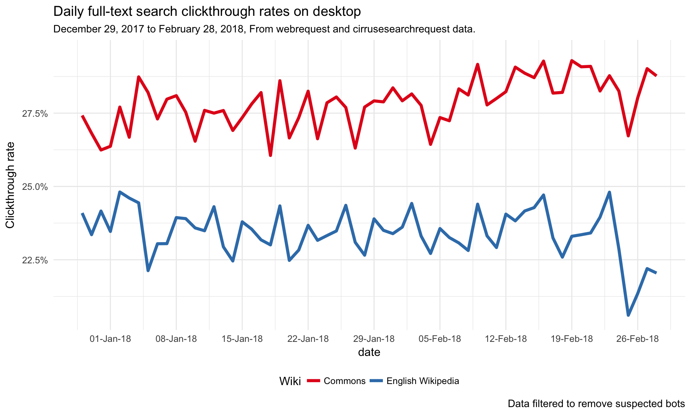
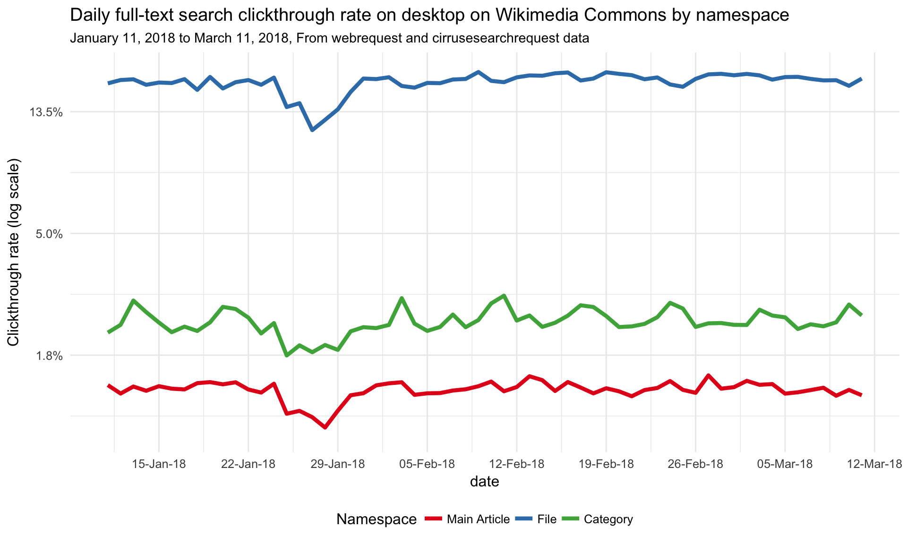

# Investigate the full-text desktop search CTR decline on Wikimedia Commons

## Overview
In [T187827](https://phabricator.wikimedia.org/T187827), we saw a decline in the overall desktop full-text search-wise clickthrough rate on Commons from 10.42% in November 2017 to 3.17% in February 2018. To find out the cause of the decline, we reviewed search metrics from November 2017 to February 2018 to identify the time and potential causes of the decline.

## Direction for investigation

1. Get the search-wise and session-wise CTR from November 2017 to February 2018. Is it a gradual decline or sudden drop? Do we see the same pattern?
3. Before and after the drop, does the distribution of the users (in terms of browser and operating systems) change a lot?
4. Check the log of several sessions with no click, is there any pattern?
5. Is this happening on other wiki as well?

Ticket: [T188421](https://phabricator.wikimedia.org/T188421)

## Search-wise and session-wise CTR from November 2017 to February 2018. 

We computed the clickthrough rate on Commons from November 2017 to February 2018 using eventlogging data (TestSearchSatisfaction2 table).

The plot shows a shows a sudden drop on Dec 14th which is in line with the deploy date of the change to include multimedia files as part of default search on commons; however, it's not clear why this change resulted in fewer clicks so further investigation is needed.  

## Review of daily search activity

A review of users daily search activity and sessions on commons between December 2017 and February 2018 shows no change in the number of search sessions around that date while the number of searches with no clicks increased.  There was also no change in event scrolling on search pages. 

## Review of SERP Offset (Clicks to other Pages)

There is also does not appear to be a sudden increase or decline the proportion of full-text searches with clicks to see other pages of the search results. 

## Distribution of users (by browser and operating systems)

The proportion of user by operating system (Mac, Windows, etc) does not vary much the weeks before and after Dec 14th.  The proportion of Chrome 63 users went up the week of 2017-12-17; however, Chrome 63 was released on 2017-12-05 and is the likely cause of this shift. 

## Media Viewer Clicks Investigation

The Dec 14th release included multimedia files as part of default search on Commons so that the file result page and thumbnail of the image appear on the default search result page. As a result of this change, users no longer need to click the multimedia tab to access these files and are more likely to view them on the search result page. Both of these types of clicks (image file clicks and thumbnail mediaviewer image clicks) on the search result page are currently not logged by the eventlogging database (TestSearchSatisfaction2) due to different htmls generated for files results versus articles pages (Text page results will have a div with a class mw-search-result-heading). This would likely result in a much lower ctr. A ticket [T189242](https://phabricator.wikimedia.org/T189242) was issued to address this bug.

## CTR estimation using WebRequest and CirrusSearchRequestSet

To estimate the real ctr on Commons during this timeframe, we used backend data by joining full text search request logs from the CirrusSearchRequestSet against webrequests to pages that have a searchToken in the referer. This query included clicks on thumbnails to open the media viewer.

At the time of the query, the earliest data available was from Dec 16th making it difficult to determine any direct impacts from the Dec 14th change. However, using the backend data method, we found a much higher overall full-text desktop daily ctr on Commons (27.89%) than the overall search-wise ctr found in November 2017 (10.42%) or February 2018 (3.17%) using eventlogging data.

We also reviewed the daily ctr on commons by namespace, specifically looking at the ctr on search pages to file/media description page (namespace_id = 6),main article pages (namespace_id = 0) and category pages (namespace_id = 14). The plot shows a higher daily ctr to media files on Commons compared to main article pages and category pages.  The exclusion of the file/media clicks from the eventlogging dataset would explain the much lower ctr that was found using that dataset.

